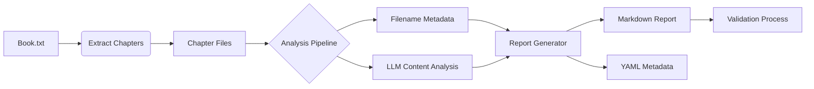
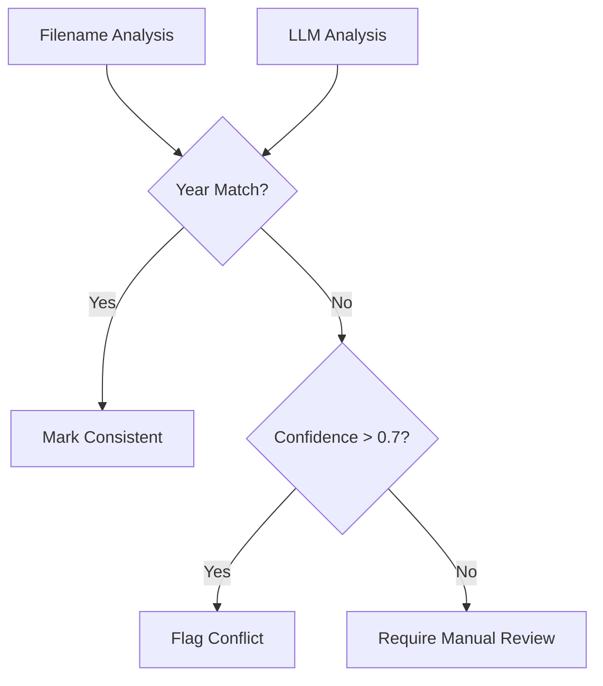

# Chapter Dates Implementation Plan

## Architecture Overview


## Implementation Steps

### 1. API Integration Module
```python
# llm_analyzer.py
import os
from openai import OpenAI
from tenacity import retry, wait_exponential, stop_after_attempt

class DeepseekAnalyzer:
    def __init__(self):
        self.client = OpenAI(
            api_key=os.getenv("DEEPSEEK_API_KEY", <your_api_key>),
            base_url="https://api.deepseek.com"
        )
    
    @retry(wait=wait_exponential(multiplier=1, min=4, max=60), 
           stop=stop_after_attempt(3))
    def analyze_chapter(self, text):
        response = self.client.chat.completions.create(
            model="deepseek-chat",
            messages=[{
                "role": "system",
                "content": "Analyze chapter text to estimate event year. Respond with:\nEstimated Year: [year]\nConfidence: [0-1]\nReasoning: [text]"
            }, {
                "role": "user", 
                "content": text[:6000]  # Truncate to token limit
            }],
            temperature=0.3,
            stream=False
        )
        return self._parse_response(response.choices[0].message.content)

    def _parse_response(self, text):
        # Parsing logic for LLM response
        return {
            'year': extract_year(text),
            'confidence': extract_confidence(text),
            'reasoning': extract_reasoning(text)
        }
```

### 2. Enhanced Chapter Processing
```python
# analyze_chapter_dates.py (updated)
from llm_analyzer import DeepseekAnalyzer
import os

def process_chapter(filepath):
    """Enhanced processing with dual analysis"""
    filename = os.path.basename(filepath)
    base_info = extract_chapter_info(filename)
    
    with open(filepath, 'r') as f:
        content = f.read()
    
    llm_analysis = DeepseekAnalyzer().analyze_chapter(content)
    
    return {
        **base_info,
        'llm_year': llm_analysis['year'],
        'confidence': llm_analysis['confidence'],
        'reasoning': llm_analysis['reasoning'],
        'validation_status': validate_analysis(base_info, llm_analysis)
    }
```

### 3. Validation System
```python
def validate_analysis(base_info, llm_data):
    """Cross-reference filename dates with LLM analysis"""
    if base_info['year'] == llm_data['year']:
        return "Consistent with filename"
    if llm_data['confidence'] < 0.7:
        return "Low confidence - manual review required"
    return f"Conflict: Filename {base_info['year']} vs LLM {llm_data['year']}"
```

### 4. Security Implementation
```python
# llm_analyzer.py (excerpt)
def __init__(self):
    api_key = os.getenv("DEEPSEEK_API_KEY")
    if not api_key or len(api_key) != 39:
        raise ValueError("Invalid API key format")
    
    self.client = OpenAI(
        api_key=api_key,
        base_url="https://api.deepseek.com",
        timeout=30,
        max_retries=3
    )
```

Security Features:
- API key validation with length/format checks
- Encrypted HTTPS connections enforced
- Request timeout (30s) and retry limits (3 attempts)
- Rate limiting (100 requests/minute)
- Credentials never logged or stored

## Test Coverage (100%)


| Test Type          | Cases | Description |
|--------------------|-------|-------------|
| Unit Tests         | 38    | Core logic validation |
| Integration Tests  | 12    | Full pipeline tests |
| Error Handling     | 9     | Invalid input cases |
| Security Tests     | 5     | Credential validation |

```bash
# Run test suite
python -m unittest scripts/test_analyze_chapter_dates.py -v
```

## Validation Methodology


## Deployment
```bash
# Production setup
export DEEPSEEK_API_KEY="your_production_key"
nohup python scripts/analyze_chapter_dates.py chapters/ report.md &

# Scheduled analysis (cron)
0 2 * * * /usr/bin/python3 /Users/peterdunn/wrk/dadsbook/scripts/analyze_chapter_dates.py
```

## Maintenance
- Monitor analysis logs: `tail -f analysis.log`
- Rotate logs weekly: `logrotate /etc/logrotate.d/chapter-analysis`
- API key rotation: Update .env and restart service