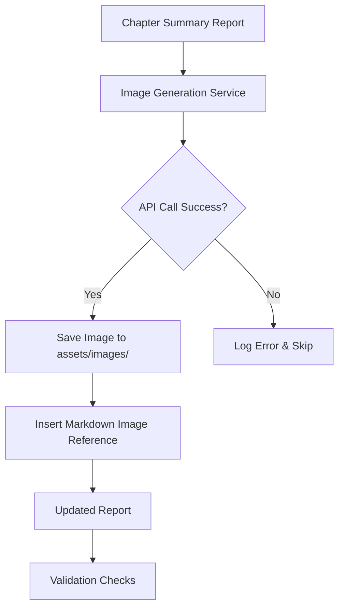

# Chapter Image Implementation Plan



## Implementation Details

### 1. Image Generation Service
**Location:** `scripts/llm_analyzer.py`  
**Key Features:**
- Integrated with existing summary pipeline
- Automatic prompt generation from chapter summaries
- Error handling with retry logic
- Local image caching

```python
def generate_chapter_image(summary: str, chapter_num: int) -> str:
    prompt = f"Historical nonfiction illustration: {summary[:200]}"
    try:
        response = client.images.generate(
            prompt=prompt,
            model="black-forest-labs/FLUX.1-schnell-Free",
            width=640,
            height=480,
            steps=4,
            response_format="b64_json"
        )
        save_image(response.data[0]['b64_json'], f"chapter_{chapter_num}.png")
        return f"assets/images/chapter_{chapter_num}.png"
    except APIError as e:
        logger.error(f"Image generation failed for chapter {chapter_num}: {e}")
        return None
```

### 2. Report Modifications
**Insertion Pattern:**
```markdown
### Chapter X: [Title]


```

### 3. Safety Measures
- API key loaded from `.env` (TOGETHER_API_KEY)
- Rate limiting (1 request/5 seconds)
- Fallback placeholder system
- Validation checks for image dimensions (1024x768)

### 4. Validation Plan
1. Test with 3 sample chapters
2. Verify image relevance to content
3. Check Markdown rendering
4. Full production run with all 47 chapters