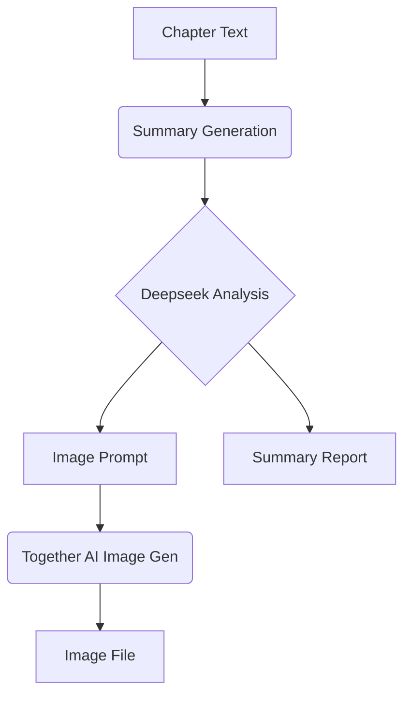

# Chapter Image Prompt Implementation

## Overview
This document describes the enhanced image prompt generation system using Deepseek AI for historical nonfiction illustrations in oil painting style.

## Implementation Diagram


## Key Components
1. **Prompt Configuration** (`llm_analyzer.py`)
   - New `IMAGE_PROMPT_CONFIG` with structured requirements
   - Focus on historical accuracy and artistic elements

2. **Generation Workflow**
   ```python
   def generate_chapter_image(summary, chapter_num):
       prompt = analyzer.generate_image_prompt(summary)
       image = together_client.generate(prompt)
       save_image(image, chapter_num)
       update_summary_report(chapter_num, prompt)
   ```

3. **Report Integration**
   - Appended to existing `chapter_summary_report.md`
   - Format:
     ```markdown
     ## Chapter [X] - [Title]
     
     **Summary**: [text]
     
     **Image Prompt**: [generated prompt]
     ```

## Configuration Details
```python
IMAGE_PROMPT_CONFIG = {
    'system_prompt': """Create vivid historical illustration prompts...""",
    'temperature': 0.4,
    'max_tokens': 600
}
```

## Example Prompt
**Input Summary**:
"RCMP officer encounters grizzly bear while patrolling Yukon wilderness in 1967"

**Generated Prompt**:
"Oil painting of a 1960s RCMP officer in winter uniform standing tense in deep Yukon woods. Golden hour light filters through pine trees onto a massive grizzly bear standing 20 feet away. Detailed rendering of vintage wool uniform, leather boots, and service revolver. Composition emphasizes scale difference between man and bear. Mood of quiet tension with misty breath visible in cold air."

## Validation Plan
1. Run against Chapter 12 (Dangerous Grizzly Encounter)
2. Verify:
   - Prompt contains specific historical details
   - Image matches prompt description
   - Report contains both summary and prompt
   - Existing workflows remain unaffected

## Troubleshooting
```bash
# Test prompt generation directly
python3 -c "from llm_analyzer import DeepseekAnalyzer; \
a = DeepseekAnalyzer(); \
print(a.generate_image_prompt('Test summary text'))"