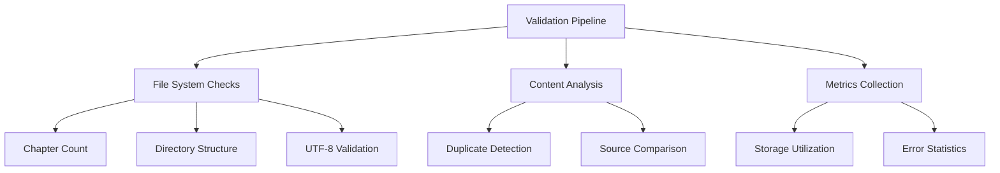

# Chapter Extraction Validation Plan

## Validation Objectives
1. Verify complete chapter extraction (47 files)
2. Ensure no duplicate content exists
3. Validate UTF-8 encoding system-wide
4. Confirm proper directory structure
5. Generate metrics-driven report

## Implementation Strategy

## Test Enhancements
- Add chapter count validation
- Implement duplicate content checks
- Strengthen UTF-8 validation tests
- Add directory structure verification

## Report Contents
- Chapter processing statistics
- Error log analysis
- Storage metrics
- Encoding validation results