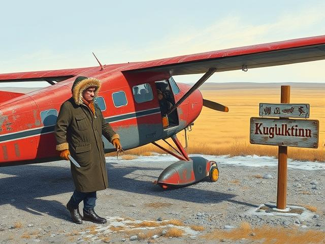

# Chapter Summary Report

## Author Context
The author's life events primarily occurred in:
- Canada's North (Yukon, Northwest Territories)
- Alaska
- Ontario (childhood)
- Alberta and Northern BC

## Overview
- Chapters processed: 47
- Analysis errors: 0
- Chapters with missing locations: 1

## Chapter Details

### Chapter 1: 01_My_Earlier_Years_that_I_Can_Remember.txt

**Estimated Year**: 1945
**Confidence**: 0.9
**Date Reasoning**: The narrator explicitly states that he started grade one in 1945 when he was five years old, which aligns with his birth year of 1940. The events described in this part of the chapter (starting school, grandfather's retirement plans, etc.) are consistent with this timeline.

**Location**: farm northeast of Coldwater, Ontario
**Coordinates**: unknown
**Location Evidence**:
"My mother and I continued to live with my grandparents on their farm, which was located about six miles northeast of Coldwater, Ontario."

**Geographical Context**:
Central Ontario, near Coldwater; aligns with the author's known connections to Ontario.

**Summary**:
The narrator recounts early memories of living with his grandparents on their farm near Coldwater, Ontario, while his father worked for the Canadian Pacific Railway. His grandfather, an Irish immigrant and former sea captain, settled in Canada after the Potato Famine, while his grandmother, a Dutch teacher, played a key role in educating the family. The narrator's father resisted taking over the farm, leading to tension and a move to a smaller property. At 14, the narrator managed the farm alone after his grandfather's heart attack, eventually selling livestock and buying a motorcycle with the proceeds.

**Preview**:
My first memory is helping my grandfather by turning the handle on the fan that blew air into his forge. I would have been about five years old at the time. My father, Robert (Bob) John Dunn, was alwa...

---

### Chapter 2: 02_Hunting_and_Fishing_in_The_Yukon.txt

**Estimated Year**: 1960s-1970s
**Confidence**: 0.8
**Date Reasoning**: The narrator describes competitive shooting events, military training, and hunting activities, which align with his adulthood. References to the Yukon, Newfoundland, and Alaska suggest a post-WWII timeframe, likely the 1960s-1970s, given his birth in 1940 and the mention of "annual shoots" over the years. The tone and context imply mid-career experiences.

**Location**: St. John’s, Newfoundland
**Coordinates**: 47.561500,-52.712600
**Location Evidence**:
"When I got transferred to St. John’s, Newfoundland, I was appointed to be the Musketry Instructor for the 'B' Division."

**Geographical Context**:
The author resided in St. John’s, Newfoundland, while serving as a Musketry Instructor. Other significant locations include the Yukon (where they later worked), Alaska (for competitions), and various other places tied to their shooting career and hunting experiences. The text also references broader regions like Eastern Canada and international locations like England and the U.S. (Las Vegas).

**Summary**:
The narrator recounts their extensive experience in hunting, shooting competitions, and guiding in Newfoundland and the Yukon. They detail winning prestigious shooting competitions, serving as a firearms instructor, and participating in sniper training. Later, as a guide in the Yukon, they led notable hunters and organized a memorable hunting trip for their father and neighbor, leveraging their expertise in big game hunting. The chapter highlights themes of marksmanship, outdoor skills, and the rugged lifestyle of northern Canada.

**Preview**:
For most of my life, I had been hunting and fishing, and when I went to Newfoundland, you could shoot one caribou. With the proliferation of introduced moose, you could shoot three moose with your one...

---

### Chapter 3: 03_The_Story_Of_The_219_Zipper_Improved_Rifle.txt

**Estimated Year**: 1960s
**Confidence**: 0.7
**Date Reasoning**: The narrator mentions joining the force and training in Regina, which likely refers to joining the police or military. Given he was born in 1940, this would place the events in his early adulthood, around the 1960s. The detailed descriptions of firearms and modifications suggest a period when such activities were common, aligning with mid-20th century gun culture. The reference to ".25 cents a minute" also hints at a time when such small denominations were more meaningful, further supporting the 1960s estimate.

**Location**: Regina
**Coordinates**: 50.454700,-104.606700
**Location Evidence**:
"I had taken it with me when I went to training in Regina"

**Geographical Context**:
Regina is in Saskatchewan, Canada, and the author mentions living in Ontario, indicating movement between these regions.

**Summary**:
The narrator recounts their passion for gunsmithing and competitive shooting, detailing the meticulous process of modifying a Winchester rifle into a high-performance "varmiter" chambered for the .219 Zipper Improved. They highlight the rifle's precision, including custom reloading techniques and a specialized Unertl scope, which allowed for remarkable accuracy in hunting and competitions. Despite its weight disqualifying it from official contests, the rifle became a prized possession, even drawing trade offers. The chapter also humorously touches on its use during training in Regina, where it was more often used to observe nurses than shoot gophers.

**Preview**:
Before I joined the force, I had an idea that I was going to become a gunsmith as I did all of my own re-leading for five different centerfire calibre rifles and attended a couple “gun smithing” cours...

---

### Chapter 4: 04_Brief_Info_On_Some_Events_In_Newfoundland.txt

**Estimated Year**: 1960
**Confidence**: 0.8
**Date Reasoning**: The narrator mentions being posted to St. John's and working in the Criminal Investigation Branch for about nine months, followed by three years in Newfoundland before transferring to the Yukon. Given his birth year of 1940, this likely places these events in the early 1960s, as he would have been in his early 20s during this period. The reference to Russian defectors during the Cold War also aligns with this timeframe. The lack of specific dates suggests some uncertainty, but the context strongly points to the early 1960s.

**Location**: St. John's
**Coordinates**: unknown
**Location Evidence**:
"When I was posted to St. John's, I was put in the Criminal Investigation Branch"

**Geographical Context**:
St. John's is the capital of Newfoundland and Labrador, where the author was stationed for three years. Secondary locations include other parts of Newfoundland (Gander, Nain, Cornerbrook, Port au Basque, Avalon Peninsula, Grand Banks) and broader regions (Yukon, Regina). The text highlights the author's work in law enforcement across Newfoundland.

**Summary**:
The narrator recounts their time in the Criminal Investigation Branch in St. John's, serving as a chauffeur for the chief investigator and assisting in major crime investigations. They also took on roles like Musketry Instructor and highway patrol, traveling across Newfoundland. A notable incident involved aiding Russian defectors during a fog delay, helping them adjust to Canadian life. The chapter highlights the challenges of remote postings, including fire control in Gander and harsh winter conditions in Nain.

**Preview**:
When I was posted to St. John's, I was put in the Criminal Investigation Branch, and it was not too long before I realized that I was the chauffeur for the chief investigator because he had lost his l...

---

### Chapter 5: 05_Learning_the_area_around_St_Johns_Newfoundland.txt

**Estimated Year**: 1949
**Confidence**: 0.9
**Date Reasoning**: The chapter explicitly states that Newfoundland officially joined Canada on March 31, 1949, and the events described (e.g., the narrator's policing duties, the transition from the Royal Newfoundland Constabulary to the RCMP) align with this timeframe. The narrator's personal experiences (e.g., ticketing Joey Smallwood, training new recruits) are directly tied to the immediate post-Confederation period.

**Location**: St. John's
**Coordinates**: unknown
**Location Evidence**:
"I was doing a radar operation outside of St. John’s at night"

**Geographical Context**:
Newfoundland and Labrador, Canada; the author was stationed here for policing duties.

**Summary**:
Newfoundland officially became Canada’s tenth province on March 31, 1949, with Joey Smallwood as its first Premier. The author recounts an incident where he ticketed Smallwood for speeding, which Smallwood later used to highlight the RCMP’s fairness. The RCMP took over policing from the Royal Newfoundland Constabulary and Newfoundland Rangers, with many Rangers transitioning due to better pay and benefits. The author, assigned to the Criminal Investigation Branch, traveled extensively across Newfoundland’s rough terrain, assisting in major investigations and conducting firearms training for inexperienced officers.

**Preview**:
Newfoundland officially joined Canada at midnight on March 31, 1949, and officially became Canada’s tenth province. Both England and the people in Newfoundland had been working on it for a number of y...

---

### Chapter 6: 06_Royal_Newfoundland_Yacht_Club.txt

**Estimated Year**: 1960s
**Confidence**: 0.8
**Date Reasoning**: The events describe the early days of scuba diving, which became popular in the 1950s and 1960s. The narrator mentions working with Memorial University, which aligns with the post-WWII expansion of universities. The cost of the outboard motor ($9,000) also fits with 1960s pricing. The lack of precise dates suggests this is an anecdotal memory from mid-century.

**Location**: St. John’s
**Coordinates**: 47.561500,-52.712600
**Location Evidence**:
"It is only about five miles out of the city of St. John’s"

**Geographical Context**:
Newfoundland and Labrador, Canada; the author's activities center around St. John’s and its coastal areas, including diving and marine biology work.

**Summary**:
The divers successfully recover a sunken outboard motor for the Royal Newfoundland Yacht Club, earning an invitation to retrieve lost anchors for club members. They later assist Memorial University by collecting rare marine specimens, leading to the discovery of an ideal location for the university's new Marine Biology Section. Their efforts are commemorated with a plaque, and they continue exploring the rich underwater ecosystem near St. John’s.

**Preview**:
When we finished our dive, we went into the man-made harbor of the Yacht Club facilities, and they were lowering a huge outboard motor onto a boat with a winch truck. We watched them lower it onto the...

---

### Chapter 7: 07_Yukon_Flotilla_1967.txt

**Estimated Year**: 1967
**Confidence**: 0.9
**Date Reasoning**: The text explicitly states that the Yukon Government Tourist Department organized the "Yukon Flotilla" trip in 1967 as part of Canada's centennial celebrations. Other events mentioned (e.g., the narrator's 1964 trip, the sale of the "Keno") are contextual but do not override the primary focus on 1967.

**Location**: Whitehorse
**Coordinates**: 60.721200,-135.056800
**Location Evidence**:

**Geographical Context**:

**Summary**:
In 1967, the Yukon Government organized a river trip from Whitehorse to Dawson City, attracting diverse participants with various watercraft. The narrator, an experienced Yukon River traveler, was tasked with ensuring safety, drawing from past adventures, including navigating the "Keno" steamboat and a long-distance journey with a forestry official. The chapter highlights challenges like hippie squatters on abandoned paddle-wheelers, the dramatic relocation of the "Whitehorse" steamboat, and preparations for the flotilla, emphasizing the river's dangers and the need for careful navigation.

**Preview**:
In 1967, the Yukon Government Tourist Department decided, as part of celebrating 100 years of Canada, to organize an adventure-filled trip from Whitehorse to Dawson City on the Yukon River. They adver...

---

### Chapter 8: 08_Dealing_with_The_Cold_Weather.txt

**Estimated Year**: 1960s
**Confidence**: 0.8
**Date Reasoning**: The narrator describes arriving in Dawson City and working as a coordinator for mountain rescue, which aligns with his early career. The mention of helicopters and aerial firefighting suggests post-WWII technology, likely the 1960s. The lack of specific dates but context of early career and technology points to this decade.

**Location**: Dawson City
**Coordinates**: 64.060100,-139.433000
**Location Evidence**:
"Arriving at the new posting of Dawson City," "about 10 to 15 miles to Dawson City," "southeast of Dawson City, about 20 miles away"

**Geographical Context**:
Dawson City is in Yukon, Canada, where the author was posted for four years. The text highlights the rugged terrain, vast distances, and proximity to Alaska. Secondary locations include the Rocky Mountains (Banff, Jasper) and Newfoundland (St. John's).

**Summary**:
The narrator arrives in Dawson City and quickly becomes involved in a hit-and-run investigation. They adapt to the vast, rugged terrain of the Yukon, including participating in mountain rescues on Mount Logan. During their first summer, they assist in firefighting efforts, including a chaotic incident where runaway firefighters are caught in an aerial water drop, leading to injuries and an unexpected resolution to their arrest. The chapter highlights the challenges of policing in remote wilderness and the unpredictable nature of the job.

**Preview**:
Arriving at the new posting of Dawson City, completely unfamiliar with its history and needing to learn a new set of ordinances and how the laws of the land were to be applied, within twenty minutes o...

---

### Chapter 9: 09_Choosing_the_Right_Police_Firearm.txt

**Estimated Year**: 1958
**Confidence**: 0.7
**Date Reasoning**: The narrator mentions being 8 years old when he first shot a deer, placing that event around 1948. Later, he states he was reloading ammunition since age 14 (~1954) and references high school Army Cadets, competitions, and early firearms training, which likely occurred in the late 1950s. The detailed account of his .357 Magnum use and roadblock incident suggests a later period in his career, likely the late 1950s or early 1960s, but the exact year is unclear. The confidence is moderate due to the broad timeline.

**Location**: unknown
**Coordinates**: unknown
**Location Evidence**:
["our property", "back of our property", "apple trees at the back fence"]

**Geographical Context**:
The text mentions general regions (Eastern Canada, Newfoundland) and specific places (Bisley, England, St. John's), but the most specific residential reference is vague ("our property"). The author's known locations include Canada's north and other provinces, but no precise home is identified here.

**Summary**:
The narrator recounts a lifelong passion for firearms, beginning with childhood hunting experiences and progressing to competitive shooting and gunsmithing. He details his marksmanship achievements, including winning competitions and serving on specialized police teams. The chapter also explores his advocacy for more effective police firearms, particularly the .357 Magnum, and includes an anecdote about stopping a stolen vehicle with a well-placed shot. His expertise in reloading and modifying firearms is a recurring theme.

**Preview**:
Having been involved with firearms for most of my life and was allowed to use a .22 single-shot rifle when I was just eight years old. Right at dusk, I was at the very back of our property and I was t...

---

### Chapter 10: 10_Refurbishing_the_RCMP_Graveyard_at_Dawson_City_YT.txt

**Estimated Year**: 1960s
**Confidence**: 0.7
**Date Reasoning**: The narrator describes events during his time as an RCMP officer in Dawson City, including refurbishing the RCMP cemetery and building a mechanized wood splitter. Given his birth year (1940) and the mention of serving a 33+ year career, this likely places these events in the 1960s or early 1970s. The reference to annual shooting competitions and the Alaska State Police rivalry also fits this timeframe. However, the exact year is unclear without more specific dates.

**Location**: Dawson City
**Coordinates**: 64.060100,-139.433000
**Location Evidence**:
"Arriving in Dawson City, I was there for about half an hour after I arrived and was sent out to investigate a hit and run where a boy riding a bicycle had been struck by a vehicle and was injured."

**Geographical Context**:
Dawson City is in Yukon, Canada, where the author resided and worked as an RCMP officer. Secondary locations include other Canadian and Alaskan cities related to competitions and assignments.

**Summary**:
The narrator recounts their time in Dawson City, where they arrested an impaired driver involved in a hit-and-run. While the driver served his sentence, the narrator put him to work refurbishing the RCMP cemetery, building a mechanized wood splitter, and assisting with community tasks. The chapter also highlights the narrator's marksmanship achievements, including winning shooting competitions and representing the RCMP against the Alaska State Police.

**Preview**:
Arriving in Dawson City, I was there for about half an hour after I arrived and was sent out to investigate a hit and run where a boy riding a bicycle had been struck by a vehicle and was injured.I lo...

---

### Chapter 11: 11_Digging_Graves_In_The_RCMP_Cemetery.txt

**Estimated Year**: 1958
**Confidence**: 0.7
**Date Reasoning**: The narrator mentions being in training for 11 months, which likely refers to his time in the Royal Canadian Mounted Police (RCMP). Given that he was born in 1940, this training would likely have occurred in his late teens or early 20s, around the late 1950s or early 1960s. The reference to "long blues" and "fatigues" aligns with RCMP uniforms of that era. The mention of tear gas training and the Regina City Police also fits this timeframe. The lack of modern equipment or references suggests a pre-1960s setting.

**Location**: Regina
**Coordinates**: unknown
**Location Evidence**:
"there was a class of members from the Regina City Police"

**Geographical Context**:
Regina is a city in Saskatchewan, Canada. The author's mention of Regina City Police suggests a connection to this location, though it may not be a primary residence. The text focuses on military and police training activities, indicating a possible temporary or professional association with the area.

**Summary**:
Two members are assigned extra duties—digging a grave—after being caught smiling at a woman during a flag ceremony. While working in the graveyard, a stray tear gas shell from a nearby police training exercise lands near them, startling one member who has a childhood trauma related to graves. Despite the scare, they finish the task, highlighting the unpredictable and sometimes darkly humorous nature of military discipline.

**Preview**:
I recall at the end of the lowering of the flag ceremony myself and another member were marching over to the Sgt. Major’s office to turn in the flag for it to be put up in the morning.As we marched al...

---

### Chapter 12: 12_Dangerous_Grizzly_Bear_Encounter.txt

**Estimated Year**: 1960
**Confidence**: 0.8
**Date Reasoning**: The text describes oil drilling operations in the Eagle Plains area, which became active in the late 1950s and early 1960s. The mention of the Dempster Highway (constructed in the late 1950s) and Socony-Mobil Oil (a company active in the region during that era) supports this timeframe. The narrator's experience with bears also aligns with his adulthood, likely in the 1960s. The extreme cold and remote conditions are consistent with early oil exploration efforts in northern Canada.

**Location**: Eagle Plains
**Coordinates**: unknown
**Location Evidence**:
"The Forestry and Game Warden received a call mid-winter from the manager of the Socony-Mobil Oil drilling camp, reporting trouble with a grizzly bear in the Eagle Plains area."

**Geographical Context**:
Eagle Plains is located about 300 miles northeast of Dawson City, Yukon, accessible via the Dempster Highway. The area is bordered by the Ogilvie and Richardson Mountains and is part of the northern Yukon/NWT region, aligning with the author's known work in Canada's north.

**Summary**:
The Forestry and Game Warden was called to Eagle Plains, a remote oil drilling area, to deal with an aggressive grizzly bear that had been raiding camps and threatening workers. Despite extreme cold (-65°F), they traveled to the site, where workers recounted terrifying encounters with the bear. After a tense nighttime confrontation near a garbage pit, the warden shot the bear, which fled into the woods, presumed fatally wounded. The chapter highlights the dangers of human-wildlife conflict in harsh, isolated environments.

**Preview**:
The Forestry and Game Warden received a call mid-winter from the manager of the Socony-Mobil Oil drilling camp, reporting trouble with a grizzly bear in the Eagle Plains area. The bear had been moving...

---

### Chapter 13: 13_Attempted_bank_robbery_at_Dawson_City.txt

**Estimated Year**: 1960s
**Confidence**: 0.7
**Date Reasoning**: The events involve a bank robbery attempt, a chase, and interactions with law enforcement, suggesting a post-WWII era. The mention of "Robert Service cheques" dated 1910 and 1925 implies these are historical artifacts, not current. The narrator's career in law enforcement and aviation aligns with mid-20th century technology and practices. The lack of modern communication (radio difficulties, no mention of computers) and the use of dynamite for bank robberies were more common in the mid-20th century. The 17th of August celebration in Dawson City is likely the Discovery Day festival, a long-standing tradition, but the narrator's involvement suggests this occurred during his active career, likely in the 1960s.

**Location**: Dawson City
**Coordinates**: unknown
**Location Evidence**:
"They had gone to Dawson City for the big celebration on the 17th of August and cased out both banks and figured that the Bank of Commerce was the easiest target as it was right at the river’s edge."

**Geographical Context**:
Dawson City is in Yukon, Canada, near the Alaska border. The text describes events involving travel between Yukon and Alaska, with the author likely based in Yukon.

**Summary**:
The chapter details an attempted bank robbery at the Bank of Commerce, where intruders entered through the roof, leaving a blood trail after one was injured. The narrator, a law enforcement officer, tracks the suspects downriver by plane to Alaska, encountering logistical challenges and uncooperative locals. The injured suspect is arrested, but due to extradition issues, no formal charges are pursued, and the case concludes with the narrator keeping mementos from the scene.

**Preview**:
An early morning call from the Bank of Commerce reported that the front door of the bank was open, and there was blood on the entrance and stairs leading to the second floor.I responded and the entran...

---

### Chapter 14: 14_Dawson_City_flood_in_1964.txt

**Estimated Year**: 1960
**Confidence**: 0.7
**Date Reasoning**: The narrator mentions it was his first winter in the Yukon, and he was born in 1940. Assuming he moved there as a young adult (around 20 years old), this would place the events around 1960. The extreme cold and flood details align with historical Yukon weather patterns, but the exact year isn't specified. The confidence is moderate due to the assumption about his age when he moved.

**Location**: Dawson City
**Coordinates**: 64.062500,-139.433300
**Location Evidence**:
"Dawson City is located right where the Klondike River dumps into the Yukon River"

**Geographical Context**:
Yukon Territory, Canada; the author describes living and working in Dawson City, a historic town in the Yukon, with references to nearby areas like Clinton Creek and Whitehorse.

**Summary**:
A sudden flood in Dawson City caused by the breaking river ice threatened the town, with water levels rising dangerously close to the dike. The narrator, a police officer, observed the ice movement and later dealt with a chaotic basement flooding incident at the detachment, where a panicked prisoner had to be rescued. The extreme winter conditions and the challenges of patrolling remote mining areas were also highlighted, emphasizing the harsh realities of life in the Yukon.

**Preview**:
The flood caught everyone by surprise as the river ice broke in the middle of the night. I got up, dressed, and went from my room into the office. Looking out the window, I saw that the river ice was ...

---

### Chapter 15: 15_Wolf_Troubles.txt

**Estimated Year**: 1960
**Confidence**: 0.7
**Date Reasoning**: The narrator mentions working with the Yukon Forest Service and Game Management for two years, likely in the 1950s or 1960s based on the context of caribou herd conservation efforts and the use of older vehicles (Chevrolet station wagon). The reference to the Forty Mile Herd's population decline and recovery suggests this occurred mid-20th century, before the 1973 historic low. The lack of modern technology (e.g., reliance on radio and manual counting) also supports this timeframe. However, the exact year is uncertain due to the lack of explicit dates.

**Location**: Dawson City
**Coordinates**: 64.062500,-139.433300
**Location Evidence**:
"When I was stationed at Dawson City," "in the two years that I spent at Dawson City," "the detachment in Dawson City"

**Geographical Context**:
Dawson City is in Yukon, Canada, and is closely associated with the author's work in wildlife management and caribou migration studies. Secondary locations like Eagle Plain and Old Crow are also in Yukon, while Prudeau Bay and the Arctic Coast are in northern Canada. The text highlights the author's deep involvement in the region's ecology and Indigenous hunting practices.

**Summary**:
The narrator recounts their time working with the Yukon Forest Service in Dawson City, studying caribou migration and managing predator populations. They used aerial photography to track the Forty Mile and Porcupine caribou herds, noting declines due to harsh winters and wolf predation. Efforts like wolf bounties and hunting restrictions helped the Forty Mile herd recover from near collapse. The narrator also describes innovative but challenging methods of wolf hunting to control their numbers. The chapter highlights the delicate balance between conservation, Indigenous hunting rights, and predator management.

**Preview**:
When I was stationed at Dawson City, I befriended a chap whowas the head of the Yukon Forest Service and Game Management, making him an ex-officio game warden.He lived in the settlement with his wife ...

---

### Chapter 16: 16_Trip_up_the_Sixty_Mile_River.txt

**Estimated Year**: 1946
**Confidence**: 0.9
**Date Reasoning**: The text explicitly mentions a grocery delivery trip by dogsled to Matson Creek up the Sixty Mile River in 1946, where the night guard found John Matson dead in his cabin. This is the only specific year provided in the chapter, and it aligns with the narrator's birth year (1940) and the context of post-WWII Yukon life. Other events are described in relation to this timeframe but lack exact dates.

**Location**: Dawson City
**Coordinates**: 64.060100,-139.433300
**Location Evidence**:
"Dawson City and in the Detachment area that we patrolled," "reported it to the RCMP Detachment," "returned to the Dawson City Hospital," "permanent three-room log cabin at the northeast end of the settlement."

**Geographical Context**:
Yukon Territory, Canada; Dawson City was a central hub for the author's RCMP duties and personal experiences in the region.

**Summary**:
The chapter recounts a patrol trip to the Sixty Mile River, where the narrator and a night guard—a Ukrainian immigrant who lost an eye in a mining accident—measure mining claims. They camp at Matson Creek, where a careless cook attracts a grizzly bear, leading to a chaotic encounter where the bear is shot after trapping the narrator in a collapsed tent. The story blends adventure, historical tidbits about the Klondike Gold Rush, and the harsh realities of life in the Yukon.

**Preview**:
The name of the Sixty Mile River comes from the fact that it is located that distance up the Yukon River from Dawson City and in the Detachment area that we patrolled.This trip was whenwe went there t...

---

### Chapter 17: 17_Stewart_Rivers_trip_from_Dawson_City.txt

**Estimated Year**: 1964
**Confidence**: 1.0
**Date Reasoning**: The text explicitly states "In late summer 1964" at the beginning, and all subsequent events are described as happening during or shortly after this trip. The narrative does not suggest any significant time jumps beyond this period.

**Location**: Burian residence at the mouth of the Stewart River
**Coordinates**: unknown
**Location Evidence**:
"We stopped at the Burian residence at the mouth of the Stewart River"

**Geographical Context**:
Yukon Territory, near the Stewart River's confluence with the Yukon River, upstream from Dawson City. The author's known locations include Yukon and Alaska, aligning with this narrative.

**Summary**:
In 1964, the narrator and a night guard traveled up the Stewart River to assess trapping opportunities and police presence. They visited the Burian family, who raised a grizzly cub and mined gold, before encountering heavy snowfall and struggling to start a fire. They later discovered active mining operations, including a family-run sluice and German miners who had relocated equipment. The narrator recovered mastodon tusks, which he later sold to meet the RCMP's marriage savings requirement. The trip concluded with a return downriver after notifying the detachment of their safety.

**Preview**:
In late summer 1964, it was decided that the police had not made their presence felt upriver on the Stewart River, which is 77 miles upstream from Dawson City and flows east for another 175 miles. I w...

---

### Chapter 18: 18_Time_at_Dawson_City_Postings.txt

**Estimated Year**: 1965
**Confidence**: 0.9
**Date Reasoning**: The text explicitly states that the narrator was posted to the Carcross Detachment in the spring of 1965, and the events described (gold theft, gold shipments, and mining activities) are contextualized within this timeframe. The mention of gold being pegged at $35.00 an ounce also aligns with historical gold prices in the mid-1960s.

**Location**: Carcross Detachment
**Coordinates**: unknown
**Location Evidence**:
"I was posted to be in charge of the Carcross Detachment."

**Geographical Context**:
Yukon Territory, Canada. The author was stationed in Carcross, a small community in southern Yukon, and worked in areas associated with the Klondike goldfields. Secondary locations include mining and administrative centers in the Yukon and a reference to Flin Flon in Manitoba.

**Summary**:
The narrator recounts their time stationed at the Carcross Detachment in 1965, balancing police duties with learning goldsmithing from a local jeweler. They describe the Klondike goldfields' operations, including dredging techniques and gold theft security measures. A tragic car accident in a tailings pond leads to the recovery of four bodies and the discovery of a rare gold nugget. The chapter also details the narrator's role in transporting gold shipments, reflecting on the immense value of the precious metal.

**Preview**:
I spent most of the fall and winter of 1964 in training, and in the spring of 1965, I was posted to be in charge of the Carcross Detachment. There was a Corporal and his family, as well as two other C...

---

### Chapter 19: 19_Seizure_of_Illegal_Two_Way_Radios.txt

**Estimated Year**: 1960
**Confidence**: 0.7
**Date Reasoning**: The narrator mentions competing in the Annual Pistol Competition between the RCMP and the Alaska State Police, suggesting this event occurred during his active service years. Given he was born in 1940, a plausible timeframe is the 1960s when he would have been in his 20s or 30s. The use of two-way radios and the context of law enforcement operations also align with this era. However, the exact year is uncertain due to lack of specific references.

**Location**: Whitehorse
**Coordinates**: 60.721200,-135.056800
**Location Evidence**:
"They had information that an American was transporting the radios up the Chilkoot Pass, and the chap from Whitehorse was going by railroad to Bennett Station..."

**Geographical Context**:
Whitehorse is the capital of Yukon, Canada, and serves as a central hub for the author's activities in the region, including law enforcement operations near the Chilkoot Pass and connections to Alaska.

**Summary**:
The narrator is tasked with intercepting smugglers transporting illegal two-way radios up the Chilkoot Pass. After setting up surveillance near Fraser, he identifies the suspect in Skagway and follows him back to the trail, where the smuggler hides the radios in a basalt crack. With help from the Alaska State Police, the narrator arrests the suspect and seizes the contraband, ensuring the disruption to legal radio frequencies is stopped. The operation highlights the rugged terrain and historical significance of the area.

**Preview**:
I got a call from Whitehorse that I was to go near the top of the Chilkoot Pass and see if I could intercept and catch the two men who were bringing in dozens of illegal two-way radios. They had infor...

---

### Chapter 20: 20_Checking_on_the_Prisoner_Work_Gang.txt

**Estimated Year**: 1960
**Confidence**: 0.7
**Date Reasoning**: The narrator mentions working with the Yukon government on improving the Chilkoot Trail, likely in a professional capacity. Given that he was born in 1940, this would place the events in his early adulthood, around the 1960s. The use of freighter canoes and prisoner labor suggests a time before modern heavy machinery was widely used, supporting a mid-20th-century timeframe. The lack of specific technological or cultural references makes exact dating difficult, but the context fits the 1960s.

**Location**: Bennett Lake
**Coordinates**: unknown
**Location Evidence**:
"My job was to check on them at least once every 6 to 10 days and transport prisoners who wanted to work outside while serving their time. I was also to provide transportation back to Whitehorse, bringing back chaps who had served their time. It meant going the full length of Bennett Lake, some 25 miles by freighter canoe..."

**Geographical Context**:
Yukon and British Columbia, Canada; the author worked along the Chilkoot Trail near Bennett Lake, with connections to Whitehorse and Carcross in the Yukon.

**Summary**:
The narrator describes their role in overseeing improvements to the Chilkoot Trail, a project led by the Yukon government using time-serving prisoners. Their duties included checking on the work crew every 6-10 days, transporting prisoners, and delivering supplies via freighter canoe and foot. The prisoners worked on leveling the trail and building bridges, extending their efforts up to the Canada/U.S. border at the Chilkoot Pass.

**Preview**:
The Yukon government had begun to improve the Chilkoot Trail that runs from the south end of Bennett Lake alongside Lake Livermore, although all of it is in the Province of British Columbia. They were...

---

### Chapter 21: 21_Looking_after_the_Aboriginal_Affairs_and_Northern_Development_file.txt

**Estimated Year**: 1968
**Confidence**: 0.8
**Date Reasoning**: The chapter mentions Jean Chrétien becoming the Minister of Indian Affairs and Northern Development (IAND) under Prime Minister Pierre Trudeau’s Liberal government. Chrétien served in this role from 1968 to 1974, placing the events likely in the early years of his tenure. The narrative also reflects post-1960s Indigenous policy shifts, aligning with Trudeau's government (elected in 1968). The lack of specific dates suggests a broad timeframe, but the political context narrows it to the late 1960s or early 1970s.

**Location**: Dawson City
**Coordinates**: 64.063100,-139.433300
**Location Evidence**:
"In Dawson City, they had a local bylaw that prevented the local Indigenous people from staying within the Dawson City area after 9

**Geographical Context**:
Yukon Territory, Canada; Dawson City is a historic town in the Yukon, near the Klondike River, and Moosehide is a nearby Indigenous settlement. The author's work with the RCMP and IAND in this region is central to the narrative.

**Summary**:
The chapter details the author's role in managing Indigenous affairs in the Yukon, including the rescinding of a discriminatory Dawson City bylaw. It highlights efforts to improve living conditions by constructing log cabins for Indigenous residents, funded by IAND and built with local labor. Despite initial success, most cabins were destroyed when residents burned structural materials for firewood, leaving only two occupied by spring. The author also exposed welfare fraud by a bar owner exploiting Indigenous clients.

**Preview**:
It seemed that at every detachment I was posted to in the North, whether temporary or permanent, I was detailed to handle the "Indian Affairs and Northern Development" (IAND) file. Today, it has recei...

---

### Chapter 22: 22_Hard_lesson_on_learning_the_social_structure_of_local_natives.txt

**Estimated Year**: 1968
**Confidence**: 0.8
**Date Reasoning**: The text mentions Jean Chrétien moving from the I.A.N.D. Ministry to becoming Justice Minister, which occurred in 1968. The passage also describes the immediate impact of this change on local practices, suggesting the events took place around that time. The narrator's age (born in 1940) and the context of the story align with this timeframe.

**Location**: unknown settlement
**Coordinates**: unknown
**Location Evidence**:
["within the settlement", "immediate area of the settlement", "hauled into the police compound", "deliver it almost daily to the elderly in the settlement"]

**Geographical Context**:
Likely a remote Indigenous settlement in Canada's north (Yukon or NWT), given the mention of RCMP, dog teams, and wood-cutting practices. The reference to Jean Chrétien's political role also aligns with Canadian governance.

**Summary**:
The chapter describes a system where Aboriginal offenders in the settlement were required to deliver firewood as punishment for minor crimes, which was then distributed to elderly residents. The narrator devised a method to deter theft by booby-trapping wood, leading to a decline in petty crime. However, after a law banned prison labor, the wood supply system collapsed. An attempt to secure wood through private arrangements failed when locals sabotaged the stockpile, reflecting deep-seated resentment and resistance to progress. The narrator ultimately handed responsibility to the new Indian Agent.

**Preview**:
With very few jobs for the Aboriginals, there was little to no wage-earning work within the settlement, and a number of minor offenses occurred that required court time and sentences to be meted out. ...

---

### Chapter 23: 23_Major_accident_south_of_Watson_Lake.txt

**Estimated Year**: 1967
**Confidence**: 1.0
**Date Reasoning**: The text explicitly states the date of the accident as "the 16th of July, 1967" and later confirms the birth of the narrator's daughter in the same year ("she was born in 1967"). The events are tightly linked to this date.

**Location**: Watson Lake
**Coordinates**: 60.063400,-128.708900
**Location Evidence**:
"I dispatched the ambulance from the fire hall in Watson Lake"

**Geographical Context**:
Watson Lake is a town in Yukon, Canada, along the Alaska Highway. The author's work and residence here are evident from dispatching emergency services and references to local landmarks. Secondary locations are along the highway, indicating the author's operational area in Yukon and northern BC.

**Summary**:
On July 16, 1967, a runaway semi-trailer carrying cement lost control on Nine Mile Hill along the Alaska Highway, resulting in a fatal crash. The driver died after the truck veered off the road, plowing through trees before stopping near a river. The author, a responding officer, recovered the body and assisted an injured passenger before rushing to Whitehorse. During the return trip, he learned his wife had given birth to their daughter, Sherry Lee Dunn, marking the day with personal significance.

**Preview**:
On the 16th of July, 1967, we received a report of a major accident at the “Nine Mile Hill,” about 90 miles south on the Alaska Highway. The reason it is called the Nine Mile Hill is that it truly is ...

---

### Chapter 24: 24_Murder_near_Watson_Lake_Yukon_Territory_1967.txt

**Estimated Year**: 1960
**Confidence**: 0.7
**Date Reasoning**: The Alaska Highway was completed in 1942, and the mention of D-8 Caterpillars and the general infrastructure suggests this event likely occurred in the post-war period, possibly the 1950s or 1960s. The presence of police radio and recruits also fits this timeframe. The exact year is uncertain, but 1960 is a reasonable estimate based on the context.

**Location**: Mile 777, Alaska Highway
**Coordinates**: unknown
**Location Evidence**:
"about ten miles east of the Hotel and Service station, which is at Mile 777," "I was about to drive on to Mile 777," "I drove up to Mile 777 to get an exact measurement of the scene from that point"

**Geographical Context**:
Yukon Territory, Canada; the author was patrolling the Alaska Highway, a major route through the Yukon, connecting to Watson Lake and Whitehorse.

**Summary**:
A police officer on patrol spots a raven struggling to carry a human skull fragment, which he retrieves after firing shots to scare the bird. Meanwhile, a distressed woman reports finding a headless body in a borrow pit while berry picking. The officer secures the scene, identifies fresh tire tracks suggesting suspects fled in a pickup truck, and waits for backup before heading to Mile 777 to gather more details. The chapter highlights the eerie discovery and the beginning of a murder investigation in a remote Yukon setting.

**Preview**:
I was on a routine patrol going west on the Alaska Highway, about ten miles east of the Hotel and Service station, which is at Mile 777, and I saw a Raven come out of the bush from the north side of t...

---

### Chapter 25: 25_Search_For_The_Swiss_Mountain_Climbers_On_The_Nahanni_River.txt

**Estimated Year**: 1960s-1970s
**Confidence**: 0.7
**Date Reasoning**: The narrator mentions attending a Mountain Rescue course in Banff and being involved in rescues on Mount Logan, which suggests this occurred during his active years in search and rescue. The lack of modern technology (e.g., reliance on road maps, no mention of GPS) and the style of equipment (inflatable canoe, reliance on helicopters for rescue) point to the mid-20th century. The Cantung Mine was operational in the 1960s-1970s, further supporting this timeframe. The exact year is uncertain, but the context aligns with this period.

**Location**: Cantung Mine
**Coordinates**: unknown
**Location Evidence**:
"I drove into the mine at Cantung, waded across the Black River, and climbed the third mountain on the east side."

**Geographical Context**:
The Cantung Mine is located in the Yukon, near the border with the Northwest Territories, aligning with the author's known residency in Canada's northern regions. Secondary locations include key points in the Yukon, NWT, and Alberta.

**Summary**:
The narrator assists four Swiss climbers planning to traverse the remote mountains near the Cantung Mine and navigate the Black and Nahanni Rivers. Despite warnings about Virginia Falls, the climbers go missing by their August 25th checkpoint. A search begins, with the narrator locating Swiss flags on the summits they intended to climb, confirming they completed their ascent but vanished during the river journey. Authorities coordinate a river search while the narrator investigates the climbing route.

**Preview**:
In the early summer, I took the information from four Swiss Mountain climbers who had intended to climb several mountains in the area north and east of the Cantung Mine, more than 300 Miles from Watso...

---

### Chapter 26: 26_Fort_McPherson_Grave_Site_Maintenance.txt

**Estimated Year**: 1967-1969
**Confidence**: 0.9
**Date Reasoning**: The narrator explicitly states he was stationed at Fort McPherson from September 1st, 1967, for two years, and describes events during this period, including refurbishing grave sites and cairns, interacting with locals involved in the Mad Trapper incident, and building cairns for the "Lost Patrol." The specific timeframe (1967-1969) is directly supported by the text. Other events mentioned (e.g., Dawson City in 1965, Coppermine in 1970) are outside this range.

**Location**: Fort McPherson, N.W.T
**Coordinates**: 67.438600,-134.880800
**Location Evidence**:
"I was stationed at Fort McPherson, N.W.T from September 1st, 1967, for two years"

**Geographical Context**:
Northwest Territories (NWT), Canada; the author was stationed here and performed duties in the surrounding area, including the Rat River and Mackenzie Delta. Other locations mentioned are secondary postings or related sites.

**Summary**:
The narrator recounts their time stationed at Fort McPherson, N.W.T., where they refurbished grave sites and cairns, including one marking where Constable Edgar Millen was killed by the "Mad Trapper." They also restored memorials for the "Lost Patrol" members who froze to death and improved cemeteries in Dawson City and Carcross. The chapter highlights the narrator's dedication to preserving RCMP history and honoring fallen members.

**Preview**:
I was stationed at Fort McPherson, N.W.T from September 1st, 1967, for two years, and one of our duties was refurbish the grave sites and cairns of ex-members that died in our whole Detachment area.I ...

---

### Chapter 27: 27_Making_a_difficult_arrest.txt

**Estimated Year**: 1960s
**Confidence**: 0.8
**Date Reasoning**: The narrative describes the use of a 26-foot freighter canoe with outboard motors, RCMP Police Otter planes, and Single Side Band Radio—technology consistent with the 1960s. The setting in the Peel River region and the RCMP's operational methods also align with mid-20th-century policing in northern Canada. The narrator's role as an active officer suggests this occurred during his service years, likely before major modernization in the 1970s. The lack of more advanced communication or transport narrows it to the 1960s.

**Location**: Fort McPherson
**Coordinates**: 67.438600,-134.880600
**Location Evidence**:
"I turned around and headed back for Fort McPherson." "When I got back to Fort McPherson, the Corporal advised me..."

**Geographical Context**:
Fort McPherson is a settlement in the Northwest Territories, Canada, near the Peel River. The author's work as an RCMP officer places them in the northern regions of Canada, including the Yukon and NWT.

**Summary**:
The narrator visits a fishing camp south of Fort McPherson, where he meets an unfamiliar large Eskimo man. Later, he learns this man is wanted for a violent assault and returns to arrest him. A tense confrontation ensues on the sandbar, involving a physical fight with sticks, before backup arrives via plane and Jeep. The suspect is subdued, and evidence of the struggle is recorded for legal proceedings.

**Preview**:
I had made a trip up the Peel River to visit and check on some of the people who had a fishing camp about fifty miles south of Fort McPherson. There were four families with their tents set up and lots...

---

### Chapter 28: 28_Shell_Oil_tragedy_with_the_drowning_of_five_men_in_the_Nodwell.txt

**Estimated Year**: 1960
**Confidence**: 0.7
**Date Reasoning**: The text describes seismic work by Shell Oil, which was active in northern Canada during the 1950s-1970s. The use of Nodwells (tracked vehicles) and Twin Otters (introduced in 1965) suggests a timeframe in the mid-20th century. The narrator's age (born 1940) implies he was likely in his 20s during these events, placing it around the 1960s. The fuel price ($3.00/gallon) aligns with early 1960s pricing in remote areas. However, exact dating is difficult without more specific references.

**Location**: Fort McPherson
**Coordinates**: 67.438600,-134.880600
**Location Evidence**:
"I returned to Fort McPherson." "They returned to Fort McPherson with the bodies so they could be sent south on the next scheduled flight." "I returned to Fort McPherson and arranged for a Twin Otter on floats to assist with the recovery."

**Geographical Context**:
Fort McPherson is a settlement in the Northwest Territories, Canada, near the Peel River. The text describes activities in the northern regions, including the Yukon and NWT, aligning with the author's known locations.

**Summary**:
Shell Oil set up a seismic camp near the Peel River, hiring locals and using Nodwell vehicles. A flood caused a Nodwell to capsize, killing five crew members—four bodies were recovered, but one was missing. The narrator conducted an extensive search, eventually locating the body by air and arranging its difficult recovery. Shell later closed the camp, and the narrator negotiated fuel exchanges to support his aircraft operations.

**Preview**:
Shell Oil had a camp, and all the fuel and supplies were taken as far south up the Peel River as the tug could push the barges loaded with their camp. They planned to do seismic work, searching for oi...

---

### Chapter 29: 29_Learning_Instrument_Flight_Rules_the_Hard_Way.txt

**Estimated Year**: 1960s
**Confidence**: 0.7
**Date Reasoning**: The narrator describes flying experiences in the Arctic, including forest fires and policing duties, which align with his career as an RCMP officer and pilot in the 1960s. The mention of "24 hours of sunlight" and remote settlements like Fort McPherson and Arctic Red River also fits this era. The lack of precise dates suggests a general timeframe rather than a specific year.

**Location**: Fort McPherson
**Coordinates**: 67.438600,-134.880600
**Location Evidence**:
"They had closed the Arctic Red River Detachment, and we were given the responsibility to do the policing of the settlement from Fort McPherson."

**Geographical Context**:
Northwest Territories, Canada; the author describes flying and boating between Fort McPherson and Arctic Red River, highlighting the remote northern environment.

**Summary**:
The chapter recounts the author's early experiences with instrument flight rules (IFR) during a policing mission in the Arctic. Faced with heavy smoke from forest fires, he navigates using basic aircraft instruments, contrasting this with his usual visual flight rules (VFR) practices. The journey highlights the challenges of flying in remote, smoke-obscured conditions and the advantages of air travel over arduous boat trips in the harsh Arctic environment. Key locations include Fort McPherson and Arctic Red River, emphasizing the rugged terrain and unpredictable weather of the region.

**Preview**:
Instrument flight rules (IFR) does not mean “I follow roads, or I follow railroads.” It involves using the basic instruments in the aircraft, allowing you to fly in zero visibility and get to your des...

---

### Chapter 30: 30_Flight_from_Fort_McPherson_to_Coppermine.txt

**Estimated Year**: 1960s (likely mid-to-late 1960s)
**Confidence**: 0.8
**Date Reasoning**: The narrator describes transferring to Coppermine (now Kugluktuk) and mentions logistical challenges with Arctic supply routes, which were common in the mid-20th century. The use of wheelbarrows and limited vehicles suggests a pre-1970s setting. The reference to "now two kids" implies some passage of time since his earlier postings (likely 1950s–early 1960s). The lack of snowmobiles (which became widespread later) and reliance on barges further supports a 1960s estimate. The RCMP's ration system and shipping methods align with known mid-century Arctic supply practices.

**Location**: Coppermine
**Coordinates**: 67.820600,-115.096600
**Location Evidence**:
"my impending transfer from Fort McPherson to Coppermine," "I was sitting at the Coppermine airport," "We were going into a posting that was on 'rations,'" "into the Coronation Gulf to be off-loaded at Coppermine."

**Geographical Context**:
Coppermine (now Kugluktuk) is in Nunavut, Canada, along the Arctic coast. The author's transfer and residence here are central to the narrative, with secondary locations in the Northwest Territories (Fort McPherson, Inuvik, Yellowknife, Hay River) and Yukon/NWT border (Tuktoyaktuk).

**Summary**:
The narrator plans the challenging transfer of their aircraft from Fort McPherson to Coppermine, calculating fuel and weather risks before successfully making the trip. Upon arrival, they prepare for life in Coppermine, where rations—pre-ordered and shipped via unreliable Arctic routes—dictate their food supply. The exhausting task of unloading and organizing the RCMP's barge shipment using an old wheelbarrow highlights the logistical hardships of remote Arctic living.

**Preview**:
With my impending transfer from Fort McPherson to Coppermine, my attention was drawn to how I was going to move my aircraft to the site of my new posting, and distance was the leading factor of concer...

---

### Chapter 31: 31_Search_For_Overdue_Canoeists.txt

**Estimated Year**: 1969
**Confidence**: 1.0
**Date Reasoning**: The text explicitly states "In the mid-summer of 1969," and all subsequent events (e.g., the radio call, the search for the ornithologists) are described as happening shortly after this time. The Cold War-era DEW Line context also aligns with the 1960s. No contradictions or ambiguities are present.

**Location**: Coppermine (Kugluktuk)
**Coordinates**: 67.826500,-115.096700
**Location Evidence**:
"In the mid-summer of 1969, I was posted to Coppermine (now called Kugluktuk), N.W.T."

**Geographical Context**:
Coppermine (Kugluktuk) is in the Northwest Territories (now Nunavut), Canada, and was the author's primary residence during this period. The text describes operations and travel in the Arctic region, including the Mackenzie Delta and along the Arctic coast.

**Summary**:
In 1969, the narrator, stationed in Coppermine, N.W.T., receives a report of two overdue ornithologists camping near the Hornady River. After assessing limited search options, he flies his own aircraft, coordinating with a DEW Line site for tracking. He locates the couple, who were stranded due to low water levels, provides supplies, and reports their status before returning. The DEW Line confirms his flight path, and the Tuktoyaktuk Detachment is updated.

**Preview**:
In the mid-summer of 1969, I was posted to Coppermine (now called Kugluktuk), N.W.T., and received a radio call from the Tuktoyaktuk Detachment on the Single Sideband radio (SSB). They informed me tha...

---

### Chapter 32: 32_Recover_of_Bodies_In_The_Open_Ocean.txt

**Estimated Year**: 1960
**Confidence**: 0.7
**Date Reasoning**: The narrator mentions being born in 1940 and describes events from his personal diving experiences, including the formation of the Services Diving Club and involvement of RCMP, Army, and university members. The context suggests this occurred in the early years of recreational scuba diving, likely in the late 1950s or early 1960s. The reference to "first open-ocean body recovery by scuba divers" also aligns with the early adoption of scuba technology post-WWII. The narrator's age (~20) fits with active diving involvement.

**Location**: Logy Bay
**Coordinates**: 47.630600,-52.668900
**Location Evidence**:
"a group of locals had held a big party on the beach down by Logy Bay"

**Geographical Context**:
Logy Bay is a coastal community near St. John's, Newfoundland and Labrador, Canada. The author's account involves diving operations in the North Atlantic, with additional references to Harbour Breton, another Newfoundland location. This aligns with the author's known experiences in Canada's northern and coastal regions.

**Summary**:
The chapter recounts a tragic recovery mission after a party at Logy Bay led to a dory sinking, drowning five locals. The narrator and fellow divers conducted a systematic underwater search, recovering four bodies before encountering a massive great white shark, forcing them to abandon the search for the fifth victim. The experience marked the first known open-ocean body recovery by scuba divers in the area and highlighted the dangers of Newfoundland's shark-infested waters.

**Preview**:
When we got the Services Diving Club up and running, and after a few members were trained, we usually had divers available for underwater recovery missions. Initially, the Canadian Army, Navy, Air For...

---

### Chapter 33: 33_Aircraft_of_Tundra.txt

**Estimated Year**: 1970
**Confidence**: 0.95
**Date Reasoning**: The narrator explicitly states that the events described occurred in the "late spring of 1970," and the context aligns with his earlier mention of being stationed in Coppermine from 1969 to 1971. The details about the flight, weather, and survival supplies are consistent with this timeframe.

**Location**: Coppermine (now Kugluktuk)
**Coordinates**: unknown
**Location Evidence**:
"I was stationed there as the number two man from September 1969 until July of 1971," "Now, it is named Kuglugtuk," "it is still situated west of the mouth of the Coppermine River on the mainland of the Arctic coast, overlooking the Coronation Gulf as part of the Arctic Ocean."

**Geographical Context**:
Northwest Territories (now Nunavut), Arctic coast of Canada. The author was stationed in Coppermine (Kugluktuk) and references other northern settlements like Aklavik and Inuvik, aligning with their known residency in Canada's north.

**Summary**:
The narrator explains the confusion around the name change from Coppermine to Kugluktuk in 1996, detailing its location near the Coppermine River and Coronation Gulf. He describes the challenges of adapting to Inuit place names and dialects, as well as the broader administrative division of the Northwest Territories. The chapter also recounts a planned flight south to scout for moose and caribou, highlighting the narrator’s preparations and concerns about his aircraft’s condition and survival supplies.

**Preview**:
As an explanation of the geographical location that I continue to refer to as Coppermine, I feel that I have to explain some of the confusion to keep you abreast of the changes that we encountered.I w...

---

### Chapter 34: 34_Flight_from_Coppermine_To_Grande_Prairie.txt

**Estimated Year**: 1971
**Confidence**: 1.0
**Date Reasoning**: The text explicitly states the year 1971 multiple times, including the approval of the transfer to Grande Prairie on July 1, 1971, and the subsequent events (house hunting trip in May 1971, moving plans, and arrival in Grande Prairie). All described events align with this timeline.

**Location**: Grande Prairie, Alberta
**Coordinates**: 55.169900,-118.797600
**Location Evidence**:

**Geographical Context**:

**Summary**:
The narrator secures a transfer to Grande Prairie, Alberta, to avoid their daughter facing harsh treatment in the local school. After a house-hunting trip reveals limited options, they arrange for a new home to be built. The narrator flies their aircraft from Coppermine to Grande Prairie, making stops and encountering delays, including a detour for a party. Upon arrival, they face setbacks with their new house construction and damaged belongings during transit, leading to disputes with government insurance.

**Preview**:
With the thought of long-distance planning two years later, I had decided that our daughter would be going into Kindergarten in the fall, and I had witnessed how the local native kids had brutally abu...

---

### Chapter 35: 35_Halloween_in_Grande_Prairie_1971.txt

**Estimated Year**: 1960s
**Confidence**: 0.7
**Date Reasoning**: The events described involve the narrator's time in law enforcement, particularly in the Yukon and Alaska, which aligns with his career timeline post-1940. The mention of the Alaska Highway (completed in 1942) and the casual handling of firearms suggest a period before stricter gun control measures, likely the 1960s. The reference to Halloween patrols and community policing also fits this era. The lack of specific dates and reliance on contextual clues limits confidence.

**Location**: Carcross
**Coordinates**: 60.166700,-134.700000
**Location Evidence**:
"When I was in Carcross in the Yukon, I accompanied him and two other members to go to Anchorage to shoot a friendly competition against the Alaska State Police."

**Geographical Context**:
Carcross is a small community in the Yukon, Canada, aligning with the author's known northern Canadian residences. Grande Prairie is in Alberta, while Anchorage, Tok, and Fairbanks are in Alaska.

**Summary**:
The chapter recounts humorous and eventful experiences with "Big Mike," an N.C.O. in Grande Prairie. Key moments include a chaotic trip to Alaska where an American accidentally shot himself, a misunderstanding about openly carried firearms, and an egg-throwing incident on Halloween. The latter involved a suspect denying involvement, only to later demand compensation for his ruined jacket, leading to a comical resolution with Mike. Themes include camaraderie, law enforcement challenges, and the unpredictability of human behavior.

**Preview**:
I had the pleasure ofBig Mikein the North, and then when I came out of the North, he was the N.C.O. i/c Grande Prairie Detachment, and a story comes to mind that on Halloween, he was a typical hands-o...

---

### Chapter 36: 36_Dog_Teams_Vs_Ski_Doos.txt

**Estimated Year**: 1960s
**Confidence**: 0.8
**Date Reasoning**: The text describes the transition from dog sleds to snow machines (Ski-Doos) in the RCMP, which aligns with the widespread adoption of snowmobiles in the Arctic during the 1960s. The narrator's advocacy for Ski-Doos and the eventual approval by Ottawa suggest this was a period of technological shift. The mention of Bombardier and Evinrude machines also fits this era, as snowmobile production and use expanded significantly in the 1960s. The narrator's personal experiences with these machines further support this timeframe.

**Location**: Fort McPherson
**Coordinates**: unknown
**Location Evidence**:
"When I was transferred from Fort McPherson to Coppermine"

**Geographical Context**:
Northwest Territories (Fort McPherson, Coppermine, Arctic Red River, Yellowknife) and Yukon (Watson Lake); the author describes experiences in Canada's northern territories, particularly in RCMP service and dog-sledding operations.

**Summary**:
The chapter contrasts the challenges of using dog teams versus Ski-Doos in Arctic travel, highlighting the unreliability of dogs (like running away when the handler falls) and the labor-intensive care they require. The author, a strong advocate for Ski-Doos, details the RCMP's transition from dogs to snow machines, including logistical struggles with heavy early models. A humorous mishap with a double-tracked Ski-Doo underscores the learning curve of mechanized travel, while the final shift to Ski-Doos marks the end of an era.

**Preview**:
Most people are totally wrong about the reliability of dogs versus Ski-Doos. I never had a Ski-Doo run away and keep ahead of me if I fell off like a dog team had the dirty habit of doing. If you fell...

---

### Chapter 37: 37_My_Help_Building_of_Our_House.txt

**Estimated Year**: 1951
**Confidence**: 0.9
**Date Reasoning**: The text explicitly states that the narrator's father arranged a loan and hired a contractor to begin building a proper home in 1951. The subsequent events (construction, basement digging, etc.) are described as happening during this period, making 1951 the most accurate estimate. The confidence is high due to the direct mention of the year.

**Location**: Coldwater, Ontario
**Coordinates**: 44.708900,-79.649400
**Location Evidence**:
"a mile and a half outside the town of Coldwater, Ontario"

**Geographical Context**:
Coldwater is a small town in Ontario, Canada, within the County of Tay. The author's family lived in a rural area near Coldwater, reflecting a transition from a farm to a more permanent home. This aligns with the author's known connections to Ontario.

**Summary**:
The narrator's father, often absent due to railroad work, moved the family from a comfortable farmhouse to a cold, inadequate tarpaper shack. After realizing its poor conditions, he arranged for a new house to be built in 1951. The narrator helped with construction, including digging the basement with a horse-drawn scoop—leading to a chaotic mishap—and hauling materials. The new house featured sawdust insulation and basic amenities, marking an improvement over their previous living situation. The old shack was sold and relocated by a neighbor.

**Preview**:
My father got into an argument with my grandfather because he had turned the farm over to him and my mother. He had not stopped working on the railroad and came home, taking the horses to a local plow...

---

### Chapter 38: 38_Injury_Accident_in_1973_near_Hythe_Alberta.txt

**Estimated Year**: 1960s
**Confidence**: 0.7
**Date Reasoning**: The narrative describes a highway patrol incident involving a semi-trailer and propane tanker, which suggests a time when such vehicles were common (post-WWII). The mention of "double nickels (55 MPH)" refers to the U.S. National Maximum Speed Law enacted in 1974, but this could be colloquial usage earlier. The technology and procedures (oxygen tanks from a hospital, flares, etc.) fit the 1960s-1970s era. The narrator was born in 1940, and this seems like an early-career incident, placing it likely in the 1960s. Confidence is moderate due to lack of explicit dates.

**Location**: Hythe, Alberta
**Coordinates**: 55.326500,-119.559200
**Location Evidence**:
"a bog burning about five miles north of Hythe, Alberta," "They arranged to borrow the oxygen tanks from the Hospital in Hythe," "would go to the hospital in Hythe for treatment"

**Geographical Context**:
Hythe is a small village in northwestern Alberta, near Beaverlodge and Grande Prairie. The author's involvement in law enforcement in this region suggests familiarity with Alberta's Peace Country. Whitehorse (Yukon) is mentioned as a secondary location.

**Summary**:
A highway patrol officer assists with traffic control near a bog fire in Hythe, Alberta, where poor visibility and numerous stranded vehicles—including an overturned propane tanker—pose dangers. While managing one-way traffic flow with a tow truck, the officer is struck by a semi-trailer, suffering injuries to his feet and legs. Despite the accident, he continues coordinating relief efforts before seeking medical treatment, where he receives stitches and treatment for burns. The chapter highlights the hazards of emergency response work and the officer's resilience.

**Preview**:
We had a report of a bog burning about five miles north of Hythe, Alberta and the Beaverlodge Detachment requested assistance from the Grande Prairie Highway Patrol to assist in controlling traffic th...

---

### Chapter 39: 39_Some_of_the_Odd_Stories.txt

**Estimated Year**: 1961
**Confidence**: 0.9
**Date Reasoning**: The narrator explicitly states that he joined the RCMP in 1961, and the events described (e.g., equitation training, driver training, Jacques's arrival) are framed within that timeframe. The mention of the equitation program ending before 1970 and women joining the force in 1975 provides additional context, but the primary events align with his initial training year.

**Location**: Regina
**Coordinates**: 50.448800,-104.617300
**Location Evidence**:

**Geographical Context**:

**Summary**:
The chapter details the rigorous RCMP training in the 1960s, focusing on the demanding equitation program before its discontinuation in 1970. Recruits endured early mornings cleaning stables, physical drills, and mastering horseback maneuvers for the Musical Ride. The author recounts humorous and challenging experiences, including teaching a fellow recruit to drive and the eventual end of the equitation program when women joined the force in 1975. The chapter highlights the discipline, exhaustion, and camaraderie of RCMP training.

**Preview**:
When I joined the RCMP in 1961, I underwent the horse riding routine that involved all the maneuvers carried out by the Musical Ride. We did this by commands from the instructor, where the Musical Rid...

---

### Chapter 40: 40_Search_for_the_missing_Prospectors.txt

**Estimated Year**: 1960s
**Confidence**: 0.7
**Date Reasoning**: The text describes the narrator's involvement in mining claims and patrols, likely during his time with the RCMP. Given that he was born in 1940 and references having a claim for five years, this would place the events in the 1960s. The mention of oil exploration and winter roads also aligns with industrial activity in the region during that era. The exact year is uncertain, but the context suggests the mid-to-late 1960s.

**Location**: Dawson
**Coordinates**: 64.060100,-139.433300
**Location Evidence**:
"When I was in Dawson, I had claim number four below the discovery claim on Bonanza Creek for five years."

**Geographical Context**:
Dawson is in Yukon, Canada, and is central to the Klondike gold region. The author's activities and patrols extended across a vast area, including parts of Alaska and the Northwest Territories.

**Summary**:
The chapter details the challenges of claim management and mining regulations in the Klondike gold region, where the RNWMP enforced strict rules on claim sizes and improvements. The author shares personal experiences maintaining a claim on Bonanza Creek, using it for gold panning demonstrations despite dwindling pay dirt. The detachment's vast patrol area, stretching into the Arctic, included oil exploration zones and remote searches, such as tracking prospectors who misled authorities about their location.

**Preview**:
We used to help the Mining Recorder patrol the creeks, and he supplied us with a 500-foot tape to measure the length of some of the claims. Then, word got out that the police were checking the placeme...

---

### Chapter 41: 41_Assisting_the_Mining_Recorder.txt

**Estimated Year**: 1960s
**Confidence**: 0.8
**Date Reasoning**: The narrator mentions being posted to Dawson City and references the RCMP (Royal Canadian Mounted Police), which replaced the RNWMP (Royal Northwest Mounted Police) in 1920. The Klondike gold rush peaked in the late 1890s, but the narrator's personal involvement in claim management, road development (Dempster Highway construction began in 1959), and oil exploration in Eagle Plain (active in the 1960s) suggests this occurred mid-20th century. The mention of helicopters and aircraft also aligns with post-WWII technology. The tone and context imply this was during the narrator's active service, likely the 1960s.

**Location**: Dawson City
**Coordinates**: unknown
**Location Evidence**:
"While I was in Dawson, I had Claim number four below the discovery claim on Bonanza Creek for five years."

**Geographical Context**:
Dawson City is in Yukon, Canada, and is central to the Klondike gold region. The author's work with the RCMP and mining claims ties closely to this area, along with mentions of surrounding regions like Alaska and the Northwest Territories.

**Summary**:
The chapter details the author's experiences assisting the Mining Recorder in measuring and enforcing claim boundaries in the Klondike gold region, highlighting differences between Canadian and American claim regulations. It describes the challenges of maintaining claims, including required improvements and the difficulty of tracking ownership. The author shares personal anecdotes about his own claim on Bonanza Creek, used for gold panning demonstrations, and discusses the vast RCMP detachment area, which included remote oil exploration zones. A notable search mission for missing prospectors in the Ogilvie Mountains is also recounted.

**Preview**:
We used to assist the Mining Recorder in patrolling the creeks, and he provided us with a 500-foot tape to measure the length of some of the claims. Once word got out that the police were checking the...

---

### Chapter 42: 42_Diving_on_The_Pirate_Ship_in_Ferryland_Harbour.txt

**Estimated Year**: 1960s-1970s
**Confidence**: 0.8
**Date Reasoning**: The narrator mentions using SCUBA gear and working with Memorial University, which became prominent in marine research in the mid-20th century. The Historical Artifacts Act enactment suggests a post-WWII legal framework. The use of a "Minox – Sesler" spy camera (a Cold War-era device) and SCUBA diving for marine archaeology aligns with 1960s-1970s technology and practices. The lack of modern digital tools (e.g., referencing film processing) further supports this timeframe.

**Location**: Ferryland
**Coordinates**: 47.025000,-52.881400
**Location Evidence**:
"Local rumor was that his ship or one of his ships had been sunk right in the harbor of Ferryland"

**Geographical Context**:
Ferryland is a historic town on the Avalon Peninsula in Newfoundland and Labrador, Canada. The author's activities (diving, research) suggest a strong connection to this region, particularly around shipwrecks and marine archaeology. Secondary locations like St. John’s and Quidi-Vidi further anchor the narrative in eastern Newfoundland.

**Summary**:
The chapter explores the history of shipwrecks around Newfoundland and Labrador, detailing efforts to document them using a map from 1903. The narrative shifts to the legend of pirate Peter Easton, whose ship allegedly sank in Ferryland harbor due to a drunken mishap. Divers later locate the wreck, uncovering artifacts like wine bottles, cannonballs, and a restored pistol, while also noting Newfoundland’s legal crackdown on treasure hunting. The story blends maritime history, folklore, and underwater exploration.

**Preview**:
Looking into the history of the hundreds of shipwrecks around the coast of Newfoundland and Labrador, we managed to take a picture of the map compiled up to 1903. We were at the museum, and the curato...

---

### Chapter 43: 43_Deepest_dive_with_perfect_visibility.txt

**Estimated Year**: 1960s
**Confidence**: 0.7
**Date Reasoning**: The narrator mentions being stationed in Newfoundland for three years, likely as part of military or government service (referenced by "the Force"). Given his birth year (1940), this would place the events in his early adulthood, likely the 1960s. The description of SCUBA diving practices (wet suits, depth gauges, awareness of decompression sickness) aligns with diving technology of that era. The reference to Memorial University and marine biology research also fits the post-WWII expansion of scientific diving. However, without explicit dates, the exact year is uncertain.

**Location**: Newfoundland
**Coordinates**: unknown
**Location Evidence**:
"Knowing that there was not one available in Newfoundland and the nearest one was at the Navy’s headquarters in Halifax, Nova Scotia"

**Geographical Context**:
Newfoundland is a province in eastern Canada, known for its fishing industry and coastal geography. The author was stationed there for three years, as mentioned in the text. Secondary locations include Halifax (Nova Scotia) and broader oceanic regions where the author has dived.

**Summary**:
The narrator and their team assist fishermen by recovering abandoned cod trap anchors in deep, clear water (100-110 feet), attaching floats to restore the traps. They follow strict dive safety protocols to avoid decompression sickness ("the bends") and collect marine samples for research. The mission is successful, aiding local fishermen while documenting their dives meticulously due to regulations.

**Preview**:
We were asked if we could retrieve a number of cod trap anchors in some deep water, and the people making the request figured it was about 80 feet of water. We prepared several float-attached parachut...

---

### Chapter 44: 44_Stories_related_to_My_Carcross_Posting.txt

**Estimated Year**: 1965
**Confidence**: 0.95
**Date Reasoning**: The narrator explicitly states, "In the early spring of 1965, I was advised that I would be taking over policing at Carcross Detachment area." This is the only specific date mentioned in the chapter, and all subsequent events (e.g., moving to Carcross, setting up the detachment, assisting with the steam-powered boat launch) logically follow this timeframe. The earlier dynamite work on Highway 69 likely occurred in the late 1950s or early 1960s (when the narrator was in his late teens or early 20s), but the primary focus of the chapter is the 1965 transition to Carcross.

**Location**: Carcross
**Coordinates**: unknown
**Location Evidence**:
"I was advised that I would be taking over policing at Carcross Detachment area, which is located south of Whitehorse, some 78 miles away, and off the Alaska Highway about 35 miles."

**Geographical Context**:
Carcross is a small community in Yukon, Canada, south of Whitehorse. The author describes living and working there as a police officer, including details about the detachment, local geography, and nearby settlements like Jake’s Corner and Whitehorse. The text also references other locations tied to the author’s past (Newfoundland) and regional travel (Alaska Highway, Tagish Road).

**Summary**:
The narrator recounts their experience as a young dynamite loader ("powder monkey") during the construction of Highway 69 in Ontario, detailing the challenges of handling nitroglycerine and earning a certification. Later, they transition to policing in Carcross, Yukon, describing the remote detachment setup, harsh weather conditions, and logistical challenges like fuel supply and radio communication. The chapter also highlights local infrastructure, including the White Pass & Yukon Railway and an Anglican-run residential school.

**Preview**:
When I was seventeen years of age, they were building the extension of Highway 400 in southern Ontario, which became Highway 69 up to Sudbury. The area at the end of the farmland is part of the Precam...

---

### Chapter 45: 45_Trip_to_the_Engineer_Gold_Mine.txt

**Estimated Year**: 1970
**Confidence**: 0.7
**Date Reasoning**: The narrator mentions the mine had been closed for "possibly thirty years," which suggests the events occurred roughly 30 years after the mine's closure. Mines in the Yukon often closed in the early 20th century (e.g., 1910s-1930s), so adding 30-40 years places this in the 1960s-1970s. The reference to a "four-wheel pickup" and the narrator's adulthood (born in 1940) also support this timeframe. However, without explicit dates, the estimate is approximate.

**Location**: Carcross
**Coordinates**: 60.166700,-134.700000
**Location Evidence**:
"Two geologists arrived in Carcross and were inquiring how they could best get to the Engineer Gold Mine."

**Geographical Context**:
Carcross is a small town in Yukon, Canada, near Windy Arm (part of Tagish Lake) and Bennett Lake. The author's activities and interactions in the text center around this area, indicating it as a primary residential or operational location. Secondary locations like Whitehorse and Dawson City are also referenced but are less central to the narrative.

**Summary**:
Two geologists explored the abandoned Engineer Gold Mine near Carcross, discovering remnants of the operation, including deteriorated explosives. The narrator assisted them and later, with a Game Branch official, safely detonated the unstable dynamite. The chapter highlights the dangers of abandoned mines and the rugged challenges of mountain travel in the Yukon.

**Preview**:
Two geologists arrived in Carcross and were inquiring how they could best get to the Engineer Gold Mine. My neighbor told them that it was on the west side of the Windy Arm and that all the buildings ...

---

### Chapter 46: 46_Tagish_Grave_Sites.txt

**Estimated Year**: 1965
**Confidence**: 1.0
**Date Reasoning**: The narrator explicitly states that he was in charge of Carcross Detachment in 1965, and the events described (such as handling human bones, patrolling the area, and interacting with Allen Innis Taylor) are framed within that year. The text provides a clear temporal anchor.

**Location**: Carcross Detachment
**Coordinates**: unknown
**Location Evidence**:
"When I was in charge of Carcross Detachment in 1965"

**Geographical Context**:
Yukon Territory, Canada; the author was stationed in Carcross, a small community in southern Yukon, and patrolled areas like Tagish River Bridge and Tagish Post, which are nearby. Secondary locations include Whitehorse (Yukon's capital) and Dawson City (a historic town in Yukon).

**Summary**:
In 1965, the narrator, stationed at Carcross Detachment, frequently responded to reports of human bones found along the Tagish River's eroding banks near a Native graveyard. They worked to rebury the remains, combat vandalism, and patrol the area, which was also a popular fishing spot. Later, they located and restored a historic gravesite from the late 1800s, only to be ordered to exhume and relocate the remains to Dawson City. The chapter highlights the challenges of preserving sacred sites amid natural erosion and human activity.

**Preview**:
When I was in charge of Carcross Detachment in 1965, I got a number of calls to attend the area of the Tagish River Bridge to examine human bones that were found on the river’s edge on the east side o...

---

### Chapter 47: 47_Auxillary_Constable_Program.txt

**Estimated Year**: 1987
**Confidence**: 0.9
**Date Reasoning**: The text explicitly states that the narrator was handed over the Auxiliary Constable program in 1987, marking the beginning of the described events. The subsequent details about training and social events likely occurred in the years following, but the primary reference point is clearly 1987.

**Location**: Sherwood Park
**Coordinates**: 53.516700,-113.316700
**Location Evidence**:
"the officer in charge of the Sherwood Park Detachment"

**Geographical Context**:
Sherwood Park is a suburban community in Alberta, Canada, near Edmonton. The mention of Regina (Saskatchewan) refers to RCMP training but is not a residential location for the author. The text suggests the author lived in or near Sherwood Park during their service.

**Summary**:
In 1987, the narrator took over the struggling Auxiliary Constable program in Sherwood Park, transforming it from a social club into an active patrol unit. Key members Fred and Brian stood out for their dedication, undergoing rigorous firearms and procedural training. Their local knowledge and professionalism made them invaluable assets, enhancing community safety. The program fostered camaraderie through monthly social events, creating lasting memories before the narrator's retirement in 1994.

**Preview**:
In 1987, I was handed over the Auxiliary Constable program by the officer in charge of the Sherwood Park Detachment to see if we could make it work. It had fallen into a social gathering at their conv...

---
